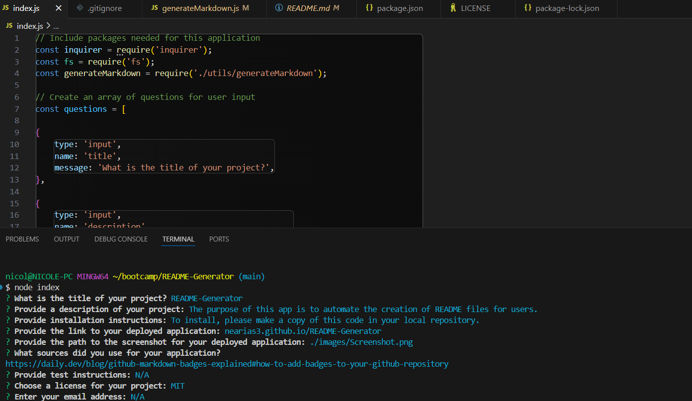

# README-Generator
  This project is licensed under the [MIT License](https://opensource.org/licenses/MIT).

  ## Description
  The purpose of this app is to automate the creation of README files for users. After running the app using node, the reader is prompted to answer several questions which will then be stored and written into the README file. These are questions that pertain to the typical README structure and while any changes specific to the project will have to be manually added, this simplifies the process by helping users build the skeleton of their README.

  ## Table of Contents
  - [Installation](#installation)
  - [Usage](#usage)
  - [License](#license)
  - [Contributing](#contributing)
  - [Tests](#tests)
  - [Questions](#questions)

  ## Installation
  
  To get started, follow these steps:

  1. Clone the repository:
        'git clone https://github.com/nearias3/README-GENERATOR.git'
  2. Navigate to your repository, then install the dependencies:
        'npm install'
  3. Run the application
        'node index.js'

  ## Usage

  

  [Click Here To View The Video Walkthrough](https://drive.google.com/file/d/1XyNNh-SCSZhAnqtn0VftoEPLwXyU7HkZ/view?usp=sharing)

  ## License
    
  Please refer to the license in the repo.

  ## Contributing

  Useful information about coding, including tutorials and guides, as well as the starter code for this project, were provided by the UT Bootcamp GitLab: [https://git.bootcampcontent.com/University-of-Texas-at-Austin/UTA-VIRT-FSF-PT-05-2024-U-LOLC/].

  The MIT license badge and a guide to writing that code: [https://daily.dev/blog/github-markdown-badges-explained#how-to-add-badges-to-your-github-repository]

  I frequently referred to Mozilla's developer tool blogs (MDN Web Docs) for help identifying the correct code and syntax: [https://developer.mozilla.org/en].

  ## Tests
  
  N/A

  ## Questions

  You can find more of my work at [nearias3](https://github.com/nearias3).